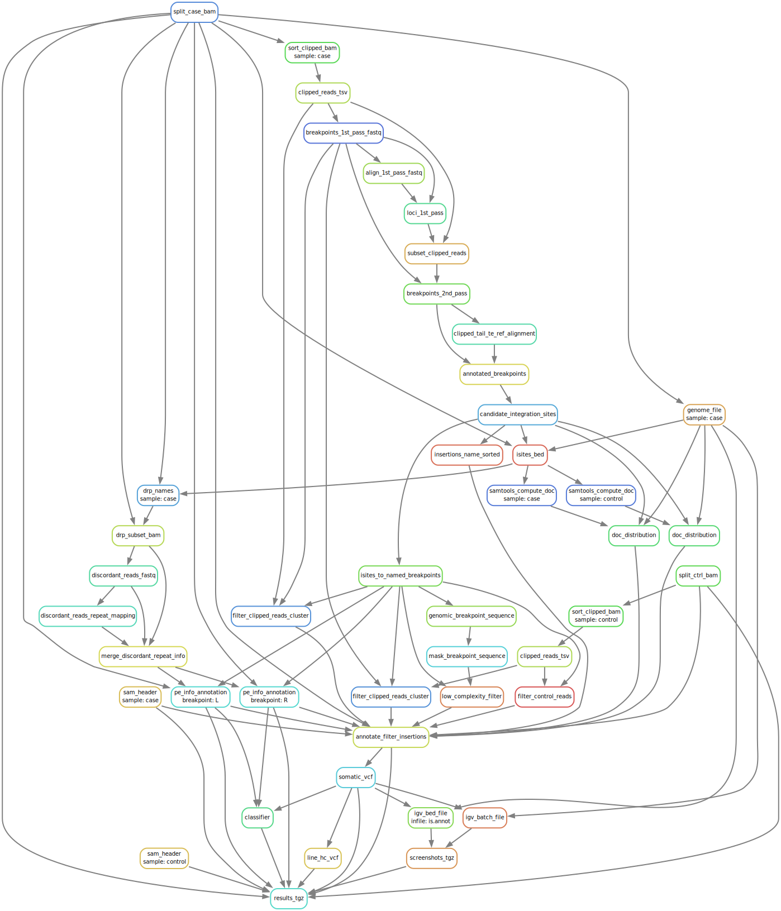

## Building Docker image
Clone the repository, from the main directory of the repository run
```
tar -czf totalrecall.src.tgz $(git ls-files)
```
followed by
```
Docker build . -t totalrecall:devel
```
This will build the Docker container image for the current version of TotalReCall.

To build the container image the following files are needed:

`files/hg38.tgz` - archive with the genome and the index: `genome.fa.gz`, `genome.fa.gz.fai`, `genome.fa.gz.gzi`

`files/igv_211.tgz` - IGV

`files/samtools` - newer version of samtools

To build the container image for the demo dataset build the reference for `hg19`:
```
wget ftp://ftp.1000genomes.ebi.ac.uk/vol1/ftp/technical/reference/phase2_reference_assembly_sequence/hs37d5.fa.gz
mv hs37d5.fa.gz genome.fa.gz
samtools faidx genome.fa.gz
tar -czf hg19.tgz genome.fa.gz genome.fa.gz.fai genome.fa.gz.gzi 
mv hg19.tgz files
```
and build using the custom genome:
```
docker build --build-arg genome_tar="files/hg19.tgz" . -t totalrecall:demo
```

## Run
To run the code:

* Place `case.bam`, `case.bam.bai`, `control.bam`, `control.bam.bai` into the project directory
* Run using the container:
```
snakemake -j 1 -s /opt/totalrecall/Snakefile -p results.tgz
```
Archive with the results `results.tgz` contains the results, inluding the list of LINE1 elements `line.vcf`.

Makre sure to set `LC_COLLATE=C` to ensure the same lexicographical sort order betwen the OS `sort` command and python `sort` (the latter uses Unicode, which coincides with the ASCII table for the numbers and the Latin characters).

## Workflow DAG

